# Checkpoint Processing Diagram (Current)

This Mermaid diagram reflects the current implemented flow, including invalid-payload dropped-offset handling and timer-batched checkpoint commits.

```mermaid
flowchart LR
  A[Kafka Source] --> B[KafkaToMessageTransform]
  B --> C[SelectContiguousOffsetsWithGapEventsTransform]

  C -->|main contiguous envelopes| D[Window Fixed 10s]
  C -->|side output gap-timeout offsets| G1[Gap Timeout Handled Offsets]

  D --> E[FilterValidPayloadDoFn]
  E -->|valid envelopes| F[WriteRawMessageTransform]
  E -->|side output dropped-invalid offsets| G2[Dropped Invalid Handled Offsets]

  F -->|BQ success rows| H1[ExtractHandledWriteOffsetsFn]
  F -->|BQ failed rows| H2[ExtractFailedRowsDoFn]
  H2 --> H3[ExtractHandledWriteOffsetsFn]

  H1 --> I[DropInvalidHandledRowsFn]
  H3 --> I

  I --> J1[Handled Offsets from BQ]
  G1 --> J2[Handled Offsets from Gap Timeout]
  G2 --> J3[Handled Offsets from Invalid Drop]

  J1 --> K[Merge All Handled Offsets]
  J2 --> K
  J3 --> K

  K --> L[GlobalWindows + Repeating Processing-Time Trigger]
  L --> M[CommitHandledOffsetsTransform]
  M --> N[CommitContiguousHandledOffsetsDoFn]
  N -->|timer-batched commits| O[CheckpointService.updateOffsetCheckpoint]
  O --> P[(Firestore topic:partition checkpoint)]
```

## Notes

- Commit state is keyed by `topic:partition`.
- `GlobalWindows` ensures one state timeline per key before commit.
- Firestore writes are async and timer-batched.
- Invalid payload drops are part of handled offsets to avoid contiguous frontier stalls.

